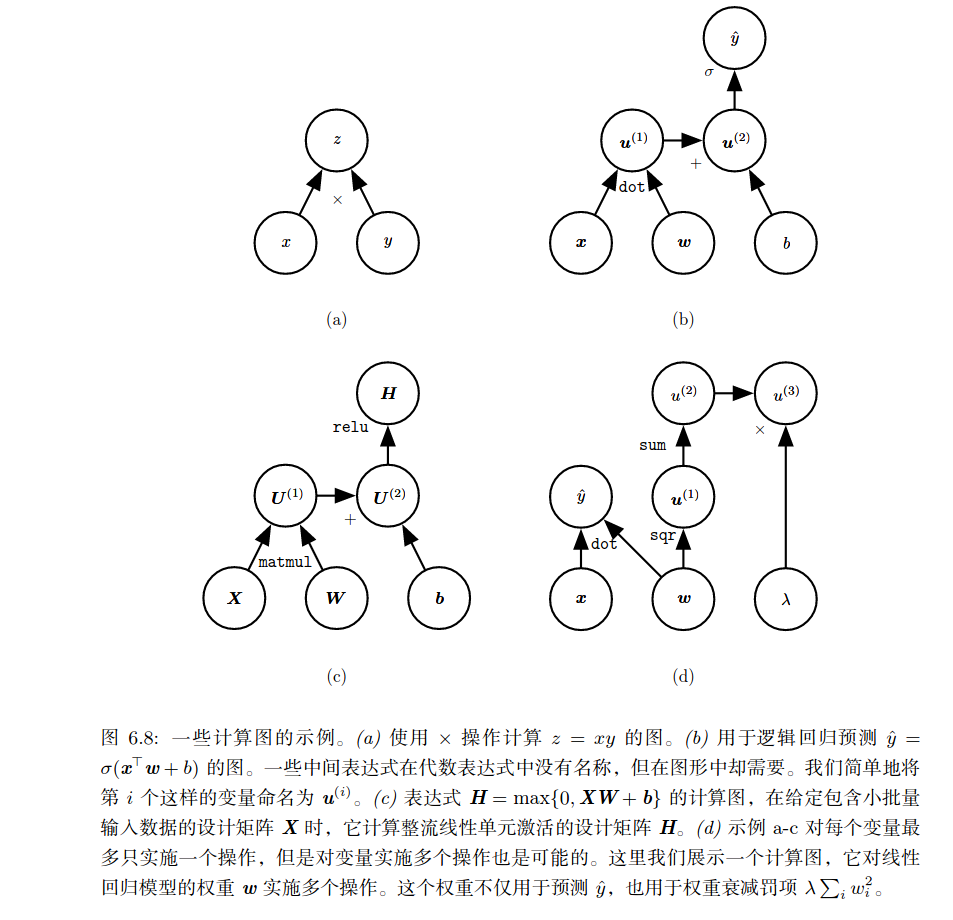
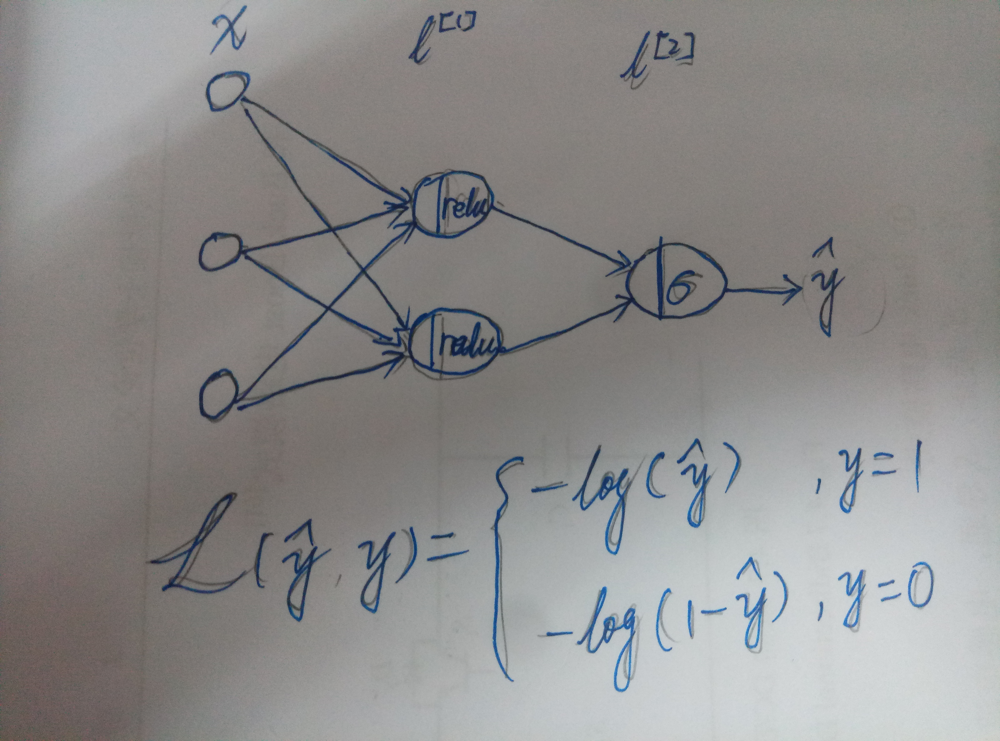
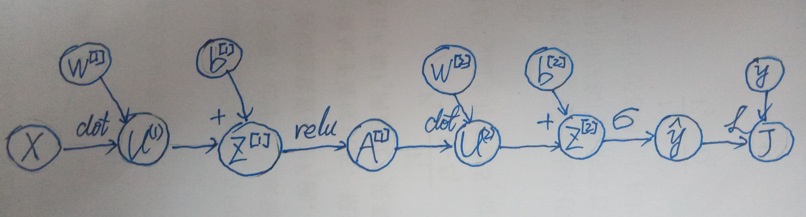

# 反向传播及其它微分算法

## 反向传播和梯度下降概念辨析

当我们使用前馈神经网络接收输入 $\boldsymbol x$ 并产生输出 $\boldsymbol {\hat y}$ 时，信息通过网络向前流动。输入 $\boldsymbol x$ 提供初始信息，然后传播到每一层的隐层单元，最终产生输出 $\boldsymbol {\hat y}$。这称之为 **前向传播**。在训练过程中，前向传播可以持续向前知道它产生一个 **标量代价函数** $J(\boldsymbol \theta)$。**反向传播** 算法，允许来自代价函数的信息通过网络向后流动，以便计算梯度。  

反向传播这个术语经常被误解为用于多层神经网络的整个学习算法。实际上，**反向传播仅指用于计算梯度的方法，而另一种算法，例如随机梯度下降，使用该梯度来进行学习**。此外，反向传播经常被误解为仅适用于多层神经网络，但是 **原则上反向传播可以计算任何函数的导数（可导）** （对于一些函数，正确的响应是报告函数的导数是未定义的）。

## 计算图

以下是一些计算图的示例：

计算图中节点表示变量，有向边表示操作。

## 微积分中的链式法则

微积分中的链式法则用于计算复合函数的导数，**反向传播是一种应用链式法则计算导数的算法**，使用高效的特定运算顺序。
设 $x$ 是实数，$f$ 和 $g$ 是从实数映射到实数的函数。假设 $y=g(x)$ 并且 $z=f(g(x)) = f(y)$。那么对应的链式法则为
$$ \frac {d z} {d x} = \frac {d z} {d y} \frac {d y} {d x} $$ 
我们可以将这种标量情况进行扩展。假设 $\boldsymbol x \in \Bbb R^m, \boldsymbol y \in \Bbb R^n$，$g$ 是从 $\Bbb R^m$ 到 $\Bbb R^n$ 的映射，$f$ 是从 $\Bbb R^n$ 到 $\Bbb R$ 的映射。如果 $\boldsymbol y=g(\boldsymbol x)$ 并且 $z=f(\boldsymbol y)$，那么
$$ \frac {\partial z} {\partial x_i}  = \sum_j {{\frac {\partial z}{\partial y_j}} {\frac {\partial y_j} {\partial x_i}}} $$
使用向量记法，可以等价地记为
$$ \triangledown_{\boldsymbol x}z = {\left(\frac {\partial \boldsymbol y}{\partial \boldsymbol x} \right)}^T  \triangledown_{\boldsymbol y}z $$
这里 $\triangledown_{\boldsymbol x}z$ 表示 $z$ 对 $\boldsymbol x$ 的梯度，$\frac {\partial \boldsymbol y}{\partial \boldsymbol x}$ 是 $g$ 的 $n \times m$ 的 Jacobian 矩阵。

通常，我们将反向传播算法应用于任意维度的张量，而不仅仅用于向量。从概念上讲，这与使用向量的反向传播完全相同。唯一的区别就是如何将数字排列成张量。我们可以想象，**在运行反向传播之前，将毎个张量压扁变平为一个向量，计算一个向量值梯度，然后将该梯度重新构造成一个张量。** 从这种重新排列的观点来看，反向传播仍然将 Jacobian 乘以梯度。

为了表示值 $z$ 关于张量 $\mathsf X$，我们记为 $\triangledown_{\mathsf X} z$，如果 $\mathsf Y = g(\mathsf X)$ 并且 $z=f(\mathsf Y)$，那么
$$ \triangledown_{\mathsf X} z = \sum_j{ \left( \triangledown_{\mathsf X} \mathsf Y_j \right) \frac{\partial z}{\partial \mathsf Y_j}} $$
这里 $\mathsf Y_j$ 中的 $j$ 表示将 $\mathsf Y$ 压扁后的索引。

## 反向传播

举个栗子：
假如有如下神经网络结构

为了便于计算，损失函数 $L$ 可以写成：
$$ L(\hat y, y) = -y \log(\hat y) - (1-y)\log(1-\hat y) $$
它的输入特征有 3 个维度，假设共有 4 个数据，则
$$\begin{aligned} 
\boldsymbol X & = [\boldsymbol x^{(1)}, \boldsymbol x^{(2)}, \boldsymbol x^{(3)}, \boldsymbol x^{(4)}] \\
& = \begin{bmatrix}
x_1^{(1)} & x_1^{(2)} & x_1^{(3)} & x_1^{(4)} \\
x_2^{(1)} & x_2^{(2)} & x_2^{(3)} & x_2^{(4)} \\
x_3^{(1)} & x_3^{(2)} & x_3^{(3)} & x_3^{(4)} 
\end{bmatrix}
\end{aligned}$$\
依次从前往后计算，有
$$\begin{aligned} 
\boldsymbol Z^{[1]} & = {\boldsymbol W^{[1]}}^T \boldsymbol X + \boldsymbol b^{[1]} \\
\boldsymbol A^{[1]} & = relu \left( \boldsymbol Z^{[1]} \right) \\
\boldsymbol Z^{[2]} & = {\boldsymbol W^{[2]}}^T \boldsymbol A^{[1]} + \boldsymbol b^{[2]} \\
\boldsymbol {\hat y} & = \sigma \left( \boldsymbol Z^{[2]} \right) = \frac 1 {1+e^{-\boldsymbol Z^{[2]}}} \\ 
\boldsymbol J & = \frac 1 m \sum_i^m L({\hat y}_i, y_i)
\end{aligned}$$
最后计算出来的 $\boldsymbol J$ 是一个标量。整个计算过程所对应的计算图如下：

得到损失 $\boldsymbol J$ 之后，对它进行反向求导得到参数的梯度，对于训练这个神经网络，我们需要得到 $\boldsymbol J$ 对于 ${\boldsymbol W^{[1]}}^T, \boldsymbol b^{[1]}, {\boldsymbol W^{[2]}}^T, \boldsymbol b^{[2]}$ 的梯度。

## 矩阵函数的 Jacobian 矩阵
先通过列向量化，将 $p \times q$ 矩阵函数 $\boldsymbol F(\boldsymbol X)$ 转换成 $pq \times 1$ 列向量
$$ \mathrm {vec} (\boldsymbol F(\boldsymbol X)) \stackrel{\text{def}}{=} [f_{11}(\boldsymbol X), \dots, f_{p1}(\boldsymbol X), \dots, f_{1q}(\boldsymbol X), \dots, f_{pq}(\boldsymbol X)]^T \in \Bbb R^{pq} $$
然后，该列向量对矩阵函数变元 $X$ 的列向量化转置 $(\mathrm{vec} \boldsymbol X)^T$ 求偏导，给出 $pq \times mn$ 维 Jacobian 矩阵
$$ \text D_\boldsymbol X \boldsymbol F(\boldsymbol X) \overset{\text{def}}{=} \frac{\partial{\mathrm{vec}(\boldsymbol F(\boldsymbol X))}}{\partial(\mathrm{vec} \boldsymbol X)^T} \in \Bbb R^{pq \times mn}$$
其具体的表达式为
$$ \text D_\boldsymbol X \boldsymbol F(\boldsymbol X) 
= \begin{bmatrix} 
\frac {\partial f_{11}}{\partial(\mathrm{vec} \boldsymbol X)^T} \\
\vdots \\
\frac {\partial f_{p1}}{\partial(\mathrm{vec} \boldsymbol X)^T} \\
\vdots \\
\frac {\partial f_{1q}}{\partial(\mathrm{vec} \boldsymbol X)^T} \\
\vdots \\
\frac {\partial f_{pq}}{\partial(\mathrm{vec} \boldsymbol X)^T} \\
\end{bmatrix}
= \begin{bmatrix}
\frac {\partial f_{11}}{\partial x_{11}} & \cdots & \frac {\partial f_{11}}{\partial x_{m1}} & \cdots & \frac {\partial f_{11}}{\partial x_{1n}} & \cdots & \frac {\partial f_{11}}{\partial x_{mn}} \\
\vdots & \vdots & \vdots & \vdots & \vdots & \vdots & \vdots \\
\frac {\partial f_{p1}}{\partial x_{11}} & \cdots & \frac {\partial f_{p1}}{\partial x_{m1}} & \cdots & \frac {\partial f_{p1}}{\partial x_{1n}} & \cdots & \frac {\partial f_{p1}}{\partial x_{mn}} \\
\vdots & \vdots & \vdots & \vdots & \vdots & \vdots & \vdots \\
\frac {\partial f_{1q}}{\partial x_{11}} & \cdots & \frac {\partial f_{1q}}{\partial x_{m1}} & \cdots & \frac {\partial f_{1q}}{\partial x_{1n}} & \cdots & \frac {\partial f_{1q}}{\partial x_{mn}} \\
\vdots & \vdots & \vdots & \vdots & \vdots & \vdots & \vdots \\
\frac {\partial f_{pq}}{\partial x_{11}} & \cdots & \frac {\partial f_{pq}}{\partial x_{m1}} & \cdots & \frac {\partial f_{pq}}{\partial x_{1n}} & \cdots & \frac {\partial f_{pq}}{\partial x_{mn}} \\
\end{bmatrix}$$
梯度矩阵 $\bigtriangledown_{\boldsymbol X} \boldsymbol F(\boldsymbol X)={(\text D_\boldsymbol X \boldsymbol F(\boldsymbol X))}^T$，也就是说矩阵函数的梯度矩阵是其 Jacobian 矩阵的转置。