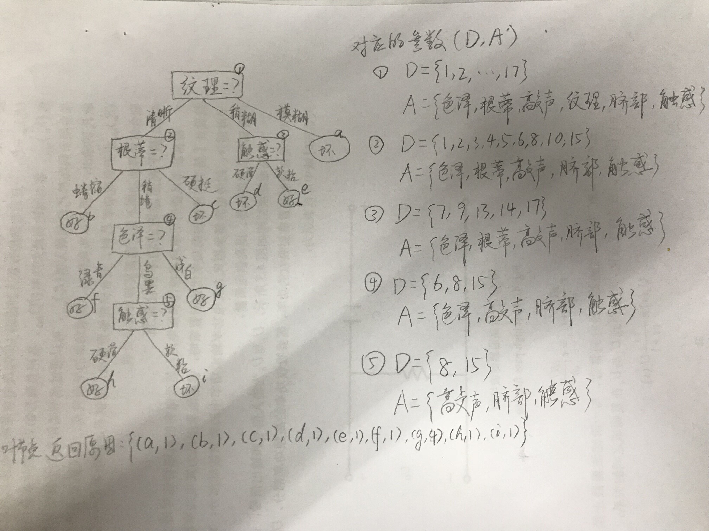

# 各种决策树

## 1.基本决策树算法

决策树算法的基本流程如下：
___________________
**输入**：训练集 $D = \{(\boldsymbol x_1,y_1),(\boldsymbol x_2,y_2,\dots,(\boldsymbol x_m,y_m)\}$；
$\quad\quad$ 属性集 $A=\{a_1,a_2,\dots,a_d\}$
**过程**：函数 TreeGenerate($D,A$)

1. 生成节点 node；
2. if $D$ 中样本属于同一类别 $C$ then
3. $\quad$ 将 node 标记为 $C$ 类节点；return
4. end if
5. if $A = \varnothing$ OR $D$ 中样本在 $A$ 上取值相同 then
6. $\quad$ 将 node 标记为叶节点，其类别标记为 $D$ 中样本数最多的类；return
7. end if
8. 从 $A$ 中选择最优划分属性 $a_*$ 作为 node 划分属性；  //**关键在于如何选择最优划分属性**
9. for $a_*$ 中的每一个值 $a_*^v$ do
10. $\quad$ 为 node 生成一个分支；令 $D_v$ 表示 $D$ 中在 $a_*$ 上取值为 $a_*^v$ 的样本子集；
11. $\quad$ if $D_v$ 为空 then
12. $\quad \quad$ 将分支结点标记为叶节点，其类别标记为 $D$ 中样本最多的类；return
13. $\quad$ else
14. $\quad \quad$ 以 TreeGenerate($D_v,A \setminus \{a_*\}$) 为分支结点
15. $\quad$ end if
16. end for

**输出**： 以 node 为根节点的一棵决策树
___________________

从决策树算法的基本流程可以看出，有以下情形会导致递归返回：
（1）当前结点包含的样本全属于同一类别，无需划分；
（2）当前属性集为空，无法划分（这种情况出现在最长的划分路径末端，所有属性都被用过为划分属性，但是样本集合中还是有异类样本）；
（3）所有样本在所有属性值上取值相同，无法划分；
（4）当前结点包含的样本集合为空，不能划分。

举个栗子：
来自西瓜数据集2

|编号   |色泽   |根蒂   |敲声   |纹理   |脐部   |触感   |好瓜   |
|------|------:|-----:|-----:|------:|----:  | -----:|-----|
|1     |青绿    |蜷缩   |浊响   |清晰   |凹陷   |硬滑   |是     |
|2     |乌黑    |蜷缩   |沉闷   |清晰   |凹陷   |硬滑   |是     |
|3     |乌黑    |蜷缩   |浊响   |清晰   |凹陷   |硬滑   |是     |
|4     |青绿    |蜷缩   |沉闷   |清晰   |凹陷   |硬滑   |是     |
|5     |浅白    |蜷缩   |浊响   |清晰   |凹陷   |硬滑   |是     |
|6     |青绿    |稍蜷   |浊响   |清晰   |稍凹   |软粘   |是     |
|7     |乌黑    |稍蜷   |浊响   |稍糊   |稍凹   |软粘   |是     |
|8     |乌黑    |稍蜷   |浊响   |清晰   |稍凹   |硬滑   |是     |
|9     |乌黑    |稍蜷   |沉闷   |稍糊   |稍凹   |硬滑   |否     |
|10    |青绿    |硬挺   |清脆   |清晰   |平坦   |软粘   |否     |
|11    |浅白    |硬挺   |清脆   |模糊   |平坦   |硬滑   |否     |
|12    |浅白    |蜷缩   |浊响   |模糊   |平坦   |软粘   |否     |
|13    |青绿    |稍蜷   |浊响   |稍糊   |凹陷   |硬滑   |否     |
|14    |浅白    |稍蜷   |沉闷   |稍糊   |凹陷   |硬滑   |否     |
|15    |乌黑    |稍蜷   |浊响   |清晰   |稍凹   |软粘   |否     |
|16    |浅白    |蜷缩   |浊响   |模糊   |平坦   |硬滑   |否     |
|17    |青绿    |蜷缩   |沉闷   |稍糊   |稍凹   |硬滑   |否     |

假设我们以**信息熵**（后面会讲）作为最优划分属性的选择标准，决策树的执行流程如下图所示

## 2.划分选择

### 2.1 信息增益

“信息熵”是度量样本集合纯度最常用的一种指标。假定当前样本集合 $D$ 中第 $k$ 类样本所占的比例为 $p_k \quad (k=1,2,\dots,|\mathcal Y|)$，则 $D$ 的信息熵定义为
$$ \text{Ent}(D) = - \sum_{k=1}^{|\mathcal Y|} {p_k \log_2 p_k}$$
信息熵越小，则 $D$ 的纯度越高。

假定离散属性 $a$ 有 $V$ 个可能的取值 $\{a^1,a^2,\dots,a^V\}$，若使用 $a$ 来对样本集 $D$ 进行划分，则会产生 $V$ 个分支节点，其中第 $v$ 个结点包含了 $D$ 中所有在属性 $a$ 上取值为 $a^v$ 的样本，记为 $D^v$。我们可根据上式计算出 $D^v$ 的信息熵，再考虑到不同分支结点所包含的样本数不同，给分支结点赋予权重 $|D^v|/|D|$，即样本数最多的分支结点的影响最大，于是可以计算出用属性 $a$ 对样本集 $D$ 进行划分所获得的“信息增益”
$$ \text{Gain} (D,a) = \text{Ent}(D) - \sum_{v=1}^V {\frac {|D^v|}{|D|} \text{Ent}(D^v)} $$
一般而言，信息增益越大，意味着使用属性 $a$ 来划分所获得的“纯度提升”越大。因此可以选择属性 $a_* = \arg \displaystyle \max_{a \in A} \text{Gain}(D,a)$ 来划分属性。
使用信息增益作为准则来选择划分属性的决策树就是著名的 **ID3决策树**。

### 2.2 信息增益率

**C4.5决策树**不直接使用信息增益，而是使用“信息增益率”来选择最优划分属性。增益率定义为
$$ \text{Gain_ratio}(D,a) = \frac {\text{Gain} (D,a)} {\text{IV}(a)}$$
其中
$$ \text{IV}(a) = - \sum_{v=1}^V{\frac {|D^v|}{|D|} \log_2 \frac {|D^v|}{|D|}} $$
称为属性 $a$ 的“固有值”。属性 $a$ 的可能取值数目越多（$V$ 越大），则 $\text{IV}(a)$ 的值通常会越大。因此，直接按增益率来选择可能对取值数目较少的属性有所偏好，因此，C4.5 不直接选择增益率最大的候选划分属性，而是使用一个启发式：**先从候选划分属性中找出信息增益高于平均水平的属性，再从中选择增益率最高的那个，作为最后选择的最优划分属性。**

### 2.3 基尼指数

**CART决策树** 使用“基尼指数”来选择划分属性。数据集 $D$ 的纯度如果用基尼值来衡量则为
$$ \begin{aligned}
\text{Gini}(D) & = \sum_{k=1}^{|\mathcal Y|} \sum_{k' \neq k} p_k p_{k'} \\
& =1-\sum_{k=1}^{|\mathcal Y|}p_k^2
\end{aligned}$$
直观来说，$D$ 的基尼值反映了从数据集 $D$ 中随机抽取两个样本，其类别标记不一样的概率。因此，基尼值越小，则数据集的纯度越高。
类似信息增益的定义，属性 $a$ 的基尼指数定义为
$$ \text{Gini_index}(D,a) = \sum_{v=1}^V {\frac {|D^v|}{|D|} \text{Gini}(D^v)} $$
于是，我们在候选属性集 $A$ 中，选择基尼指数最小的属性作为最有划分属性，即 $a_* = \arg \displaystyle \min_{a \in A} \text{Gini_index}(D,a)$。