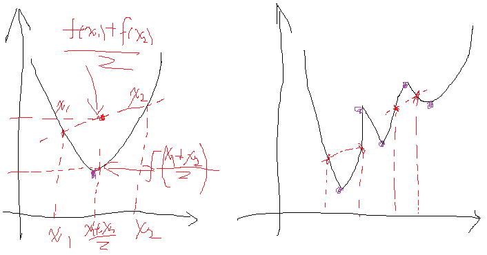
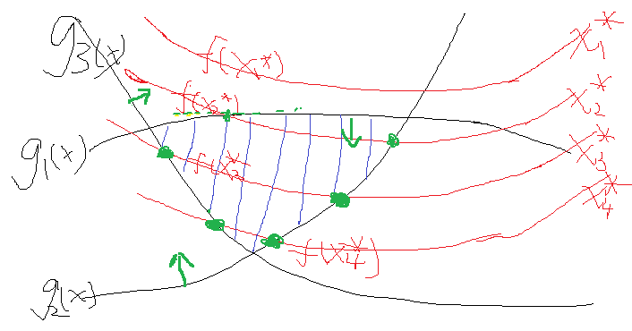

# 拉格朗日乘子法和KKT条件

## （一）关于拉格朗日乘子法
首先来了解拉格朗日乘子法，那么为什么需要拉格朗日乘子法？记住，有拉格朗日乘子法的地方，必然是一个组合优化问题。那么带约束的优化问题很好说，就比如说下面这个：
$$\begin{aligned}
min & \quad f = 2x_1^2+3x_2^2+7x_3^2 \\
s.t. & \quad 2x_1+x_2 = 1 \\ 
     & \quad 2x_2+3x_3 = 2
\end{aligned}$$

这是一个带等式约束的优化问题，有目标值，有约束条件。那么想想假设没有约束条件这个问题是怎么求解的呢？是不是直接 $f$ 对各个 $x$ 求导等于 0，解 $x$ 就可以了，可以看到没有约束的话，求导为0，那么各个 $x$ 均为 0 吧，这样 $f=0$ 了，最小。但是 $x$ 都为 0 不满足约束条件呀，那么问题就来了。这里在说一点的是，为什么上面说求导为0就可以呢？理论上多数问题是可以的，但是有的问题不可以。如果求导为 0 一定可以的话，那么 $f$ 一定是个凸优化问题，什么是凸的呢？如下图所示：

**图一** 什么是凸优化问题
凸的就是开口朝一个方向（向上或向下）。更准确的数学关系就是：
$$\quad \dfrac{f(x_1)+f(x_2)}{2} >f(\dfrac{x_1+x_2}{2}) \quad \text{或者}\\ \dfrac{f(x_1)+f(x_2)}{2} <f(\dfrac{x_1+x_2}{2})$$

注意的是这个条件是**对函数的任意 $x$ 取值**。如果满足第一个就是开口向上的凸，第二个是开口向下的凸。可以看到对于凸问题，你去求导的话，是不是只有一个极点，那么他就是最优点，很合理。类似的看看上图右边这个图，很明显这个条件对任意的 $x$ 取值不满足，有时满足第一个关系，有时满足第二个关系，对应上面的两处取法就是，所以这种问题就不行，再看看你去对它求导，会得到好几个极点。然而从图上可以看到，只有其中一个极点是最优解，其他的是局部最优解，那么当真实问题的时候你选择那个？说了半天要说啥呢，就是拉格朗日法是一定适合于凸问题的，不一定适合于其他问题，还好我们最终的问题是凸问题。
回头再来看看有约束的问题，既然有了约束不能直接求导，那么如果把约束去掉不就可以了吗？怎么去掉呢？这才需要拉格朗日方法。既然是等式约束，那么我们把这个约束乘一个系数加到目标函数中去，这样就相当于既考虑了原目标函数，也考虑了约束条件，比如上面那个函数，加进去就变为：
$$ min \quad f = 2x_1^2+3x_2^2+7x_3^2 +\alpha _1(2x_1+x_2- 1)+\alpha _2(2x_2+3x_3 - 2) $$
这里可以看到与 $\alpha_1,\alpha_2$ 相乘的部分都为0，所以 $\alpha_1,\alpha_2$ 的取值为全体实数。现在这个优化目标函数就没有约束条件了吧，既然如此，求法就简单了，分别对 $x$ 求导等于0，如下：
$$ \dfrac{\partial f}{\partial x_1}=4x_1+2\alpha_1=0\Rightarrow x_1=-0.5\alpha_1 \\ \dfrac{\partial f}{\partial x_2}=6x_2+\alpha_1+2\alpha_2=0\Rightarrow x_2=-\dfrac{\alpha_1+2\alpha_2}{6} \\ \dfrac{\partial f}{\partial x_3}=14x_3+3\alpha_2=0\Rightarrow x_3=-\dfrac{3\alpha_2}{14} $$
把它在带到约束条件中去，可以看到，2个变量两个等式，可以求解，最终可以得到 $\alpha_1 = -0.39, \alpha_2 = -1.63$，这样再代回去求 $x$ 就可以了。那么一个带等式约束的优化问题就通过拉格朗日乘子法完美的解决了。那么更高一层的，带有不等式的约束问题怎么办？那么就需要用更一般化的拉格朗日乘子法即KKT条件来解决这种问题了。

## （二）关于KKT条件

继续讨论关于带等式以及不等式的约束条件的凸函数优化。任何原始问题约束条件无非最多3种，等式约束，大于号约束，小于号约束，而这三种最终通过将约束方程化简化为两类：约束方程等于0和约束方程小于0。再举个简单的方程为例，假设原始约束条件为下列所示：
$$ min \quad f = x_1^2-2x_1+1+x_2^2+4x_2+4 \\s.t. \quad x_1+10x_2 > 10 \\ \quad \quad \quad 10 x_1-10x_2 < 10 $$
那么把约束条件变个样子：
$$ s.t. \quad 10-x_1-10x_2 <0 \\ \quad \quad \quad 10x_1-x_2 - 10<0 $$
为什么都变成等号与小于号，方便后面的，反正式子的关系没有发生任何变化就行了。

现在将约束拿到目标函数中去就变成： 
$$\begin{aligned}
L(x,\alpha) & = f(x) + \alpha_1 g_1(x)+\alpha_2 g_2(x) \\ 
& = x_1^2-2x_1+1+x_2^2+4x_2+4+ \alpha_1(10-x_1-10x_2 ) + \alpha_2(10x_1-x_2 - 10) 
\end{aligned}$$
那么KKT条件的定理是什么呢？就是如果一个优化问题
$$\begin{aligned}
\min_x & \quad f(x) \\
s.t.   & \quad g_i(x) \leq 0 \quad (i=1,2,\dots,m) \\ 
       & \quad h_j(x) = 0 \quad (j=1,2,\dots,n)
\end{aligned}$$
引入相应的拉格朗日乘子变成:
$$L(x,\alpha,\beta) = f(x) + \sum \alpha_i g_i(x) + \sum \beta_j h_j(x)$$
其中$g$是不等式约束，$h$是等式约束（像上面那个只有不等式约束，也可能有等式约束）。那么KKT条件就是函数的最优值必定满足下面条件：
(1) L对各个x求导为零； 
(2) $ h_j(x)=0 $; 
(3) $ \sum\alpha_i g_i(x) = 0，\alpha_i \geq 0 $
也就是：
$$\begin{cases}
\dfrac {\partial L} {\partial x} = 0 \\
h_j(x) = 0 \\
\sum\alpha_i g_i(x) = 0，\alpha_i \geq 0
\end{cases}$$
第一二个式子易于理解。对于第三个式子，我们知道在约束条件变完后，所有的 $g(x) \leq 0$，且 $\alpha_i \geq 0$，然后对它们求和还要等于0，这就是说，要么某个不等式 $\alpha_i = 0$，要么某个不等式 $g_i(x) = 0$。因此我们可以把KKT条件写成如下易于使用的形式：
$$\begin{cases}
\dfrac {\partial L} {\partial x} = 0 \quad \text{拉格朗日乘子法} \\
h_j(x) = 0 \quad \text{等式约束}\\
g_i(x) \leq 0 \quad \text{不等式约束}\\
\alpha_i \geq 0 \\
\alpha_i g_i(x) = 0
\end{cases}$$
后面三个式子就是常用到的由不等式引入的KKT条件。那么为什么会是这样的呢？我们假设有一个目标函数以及它的约束条件，形象地画出来就是这个样子：

假设就这么几个不等式约束吧，最终约束是把自变量约束在一定范围，而函数是在这个范围内寻找最优解。函数开始也不知道该取哪一个值是吧，那就随便取一个，假设某一次取得自变量集合为 $x_1^*$，发现一看，不满足约束，然后再换呀换，换到了 $x_2^*$，发现可以了，但是这个时候函数值不是最优的，并且 $x_2^*$ 使得 $g_1(x)$ 与 $g_2(x)$ 等于0了，而 $g_3(x)$ 还是小于0。这个时候，我们发现在 $x_2^*$ 的基础上再寻找一组更优解要靠谁呢？当然是要靠约束条件 $g_1(x)$ 与 $g_2(x)$，因为他们等于0了，很极限呀，一不小心，走错了就不满足它们两了，这个时候我们会选择 $g_1(x)$ 与 $g_2(x)$ 的梯度方向往下走，这样才能最大程度的摆脱 $g_1(x)$ 与 $g_2(x)$ 等于 0 的命运，使得他们满足小于 0 的约束条件对不对。至于这个时候需不需要管 $g_3(x)$ 呢？正常来说管不管都可以，如果管了，也取  $g_3(x)$ 在$x_2^*$ 处的梯度的话，因为 $g_3(x)$已经满足了小于0的条件，这个时候在取在 $x_2^*$ 处的梯度，你能保证它是往好的变了还是往差的变了？答案是都有可能。运气好，往好的变了，可以更快得到结果，运气不好，往差的变了，反而适得其反。那么如果不管呢？因为 $g_1(x)$ 与 $g_2(x)$ 已经在边缘了，所以取它的梯度是一定会让目标函数变好的。综合来看，这个时候我们就不选 $g_3$。那么再往下走，假设到了自变量优化到了 $x_3^*$，这个时候发现 $g_2(x)$ 与 $g_3(x)$ 等于0，也就是走到边了，而 $g_1(x)$ 小于0，可变化的空间绰绰有余，那么这个时候举要取 $g_2(x)$ 与 $g_3(x)$ 的梯度方向作为变化的方向，而不用管 $g_1(x)$。那么一直这样走呀走，最终找到最优解。可以看到的是，上述如果 $g_1(x),g_2(x)=0$ 的话，我们是需要优化它的，又因为他们本身的条件是小于0的，所以最终的公式推导上表明，是要乘以一个正系数 $\alpha$ 作为他们梯度增长的倍数，而那些不需要管的 $g(x)$ 为了统一表示，这个时候可以将这个系数设置为0，那么这一项在这一次的优化中就没有了。那么把这两种综合起来就可以表示为 $\sum\alpha_ig_i(x)=0，\alpha_i\ge0$。也即是某次的 $g(x)$ 在为最优解起作用，那么它的系数值(可以)不为0。如果某次 $g(x)$ 没有为下一次的最优解$x$的获得起到作用，那么它的系数就必须为0，这就是这个公式的含义。  
用一句话来说就是：**凸优化问题的最优解在约束条件构成的边界上**