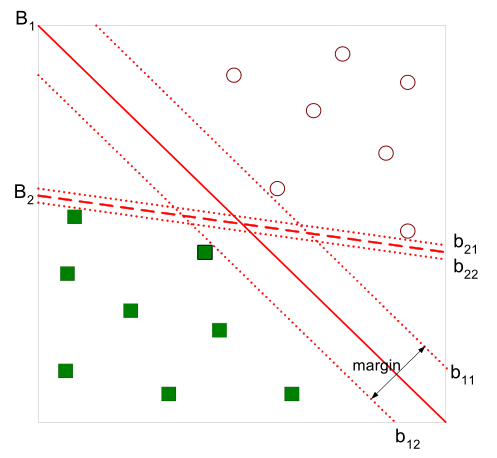
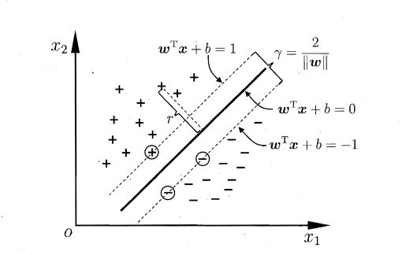

## 第六章  支持向量机

### 6.1 间隔与支持向量

给定训练样本集 $D=\lbrace (\boldsymbol x_1,y_1),(\boldsymbol x_2,y_2), \dots ,(\boldsymbol x_m,y_m) \rbrace, y_i\in\lbrace -1, +1 \rbrace$ , 分类学习最基本的想法就是训练集 $D$ 在样本空间中找到一个划分超平面，将不同类别的样本分开。但能将训练样本分开的划分超平面可能有很多，如图6.1所示，我们应该努力去找到哪一个呢？

**图6.1** 存在多个划分超平面将两类训练样本分开

直观上看，应该去找两类训练样本“正中间”的划分超平面，即图6.1中红色实线的那个，因为该划分超平面对训练样本局部扰动的“容忍”性能最好。

在样本空间中，划分超平面可通过如下现行方程来描述：
$$ \boldsymbol{w^Tx}+b=0 \tag{6.1} $$
其中 $ \boldsymbol w=(w_1;w_2;\dots;w_d) $ 为法向量，决定了超平面的方向；$b$ 为位移项，决定了超平面与原点之间的距离。显然，划分超平面可被法向量 $\boldsymbol w$ 和位移 $b$ 确定，下面我们将其记为 $(w,b)$ 。样本空间中任意点 $x$ 到超平面 $(w,b)$ 的距离可写为
$$ r=\frac {|\boldsymbol{w^Tx} + b|} {\| \boldsymbol{w} \|}  \tag{6.2}$$

假设超平面 $(\boldsymbol w,b)$ 能将样本正确分类，即对于 $(\boldsymbol x_i,y_i) \in D$，若 $y_i=+1$，则有 $\boldsymbol{w^Tx}_i + b > 0$；若 $y_i = -1$，则有 $\boldsymbol{w^Tx}_i + b < 0$。令
$$ \begin{cases}
\boldsymbol{w^Tx}_i + b \geqslant +1, & y_i=+1 \\
\boldsymbol{w^Tx}_i + b \leqslant -1, & y_i=-1 \\
\end{cases} \tag{6.3} $$

如图6.2所示，距离超平面最近的这几个训练样本使上式的等号成立，它们被称为“支持向量”，两个异类支持向量到超平面的距离之和为
$$ \gamma = \frac 2 {\| \boldsymbol w \|} \tag{6.4}$$
它被称为“间隔”

**图6.2** 支持向量与间隔

欲找到具有“最大间隔”的划分超平面，也就是要找到参数 $\boldsymbol w$ 和 $b$，使得 $\gamma$ 最大，即
$$ \begin{aligned} 
\max_{\boldsymbol w,b} \quad  & \frac 2 {\| \boldsymbol w \|} \\ 
s.t. \quad & y_i(\boldsymbol {w^Tx}_i + b) \geqslant 1, \quad i=1,2,\dots,m.
\end{aligned} \tag{6.5} $$

显然，为了最大化间隔，只需要最大化 ${\| \boldsymbol w \|}^{-1}$，这等价于最小化 ${\| \boldsymbol w \|}^2$。于是，该优化问题可写为
$$ \begin{aligned} 
\min_{\boldsymbol w,b} \quad  & \frac 1 2 {\| \boldsymbol w \|}^2 \\ 
s.t. \quad & y_i(\boldsymbol {w^Tx}_i + b) \geqslant 1, \quad i=1,2,\dots,m.
\end{aligned} \tag{6.6}$$
这就是支持向量机的基本型。

### 6.2 对偶问题

我们希望求解上式来得到最大间隔划分超平面所对应的模型
$$ f(x) = \boldsymbol{w^Tx} + b \tag{6.7}$$
其中 $\boldsymbol w$ 和 $b$ 是模型参数。注意到式(6.6)本身是一个凸二次规划问题，能直接用现成的优化计算包求解，但我们有更高效的办法。

对式(6.6)使用拉格朗日乘子法可得到其“对偶问题”。具体来说，对其中的每条约束添加拉格朗日乘子 $\alpha_i \geqslant 0$，则该问题的拉格朗日函数可写为
$$ L(\boldsymbol w,b,\boldsymbol \alpha) = \frac 1 2 {\| \boldsymbol w \|}^2 + \sum_{i=1}^{m}{\alpha_i(1-y_i(\boldsymbol {w^Tx_i} + b))} \tag{6.8} $$
其中 $\boldsymbol \alpha = (\alpha_1;\alpha_2;\dots;\alpha_m)$。

具体的推导过程如下：
* 将式(6.6)写成标准型
$$ \begin{aligned} 
\min_{\boldsymbol w,b} \quad  & \frac 1 2 {\| \boldsymbol w \|}^2 \\ 
s.t. \quad & 1 - y_i(\boldsymbol {w^Tx}_i + b) \leqslant 0, \quad i=1,2,\dots,m.
\end{aligned}$$
* 为毎个不等式约束添加拉格朗日乘子 $\alpha_i \geqslant 0$，再与目标函数相加，变成如下优化问题：
$$ \begin{aligned} 
\min_{\boldsymbol w, b, \boldsymbol \alpha} & \quad \frac 1 2 {\| \boldsymbol w \|}^2 + \sum_{i=1}^{m}{\alpha_i(1-y_i(\boldsymbol {w^Tx_i} + b))} \\
s.t. & \quad \alpha_i \geqslant 0, \quad i = 1,2,\dots,m
\end{aligned} $$
* 上式的目标函数即是拉格朗日函数，求解该目标函数的最小值，当 $\partial L / \partial \boldsymbol w = 0$，$\partial L / \partial b = 0$，$\partial L / \partial \boldsymbol \alpha = 0$ 时取得。由于这三个等式中有三个未知数，分别是 $\boldsymbol w$、$b$、$\boldsymbol \alpha$，因此可以考虑用其中一个未知数表示另外两个，考虑对 $\boldsymbol w$ 和 $b$ 求导,进而可得到式(6.9)和式(6.10)
$$ \begin{cases}
\dfrac {\partial L}  {\partial \boldsymbol w} = \boldsymbol w - \displaystyle \sum_{i=1}^{m}{\alpha_i y_i \boldsymbol x_i} = 0 \\
\dfrac {\partial L} {\partial b} = \displaystyle \sum_{i=1}^{m}{\alpha_i y_i} = 0
\end{cases}$$

令 $L(\boldsymbol w,b,\boldsymbol \alpha)$ 对 $\boldsymbol w$ 和 $b$ 的偏导为零可得
$$ \boldsymbol w = \sum_{i=1}^{m}{\alpha_i y_i \boldsymbol x_i} \tag{6.9}$$
$$ 0 = \sum_{i=1}^{m}{\alpha_i y_i} \tag{6.10} $$
将式(6.9)带入(6.8)，即可将 $L(\boldsymbol w,b,\boldsymbol \alpha)$ 中的 $\boldsymbol w$ 和 $b$ 消去，再考虑(6.10)的约束，就得到(6.6)的对偶问题
$$ \begin{aligned} 
\max_{\boldsymbol \alpha} \quad & \sum_{i=1}^m{\alpha_i} - \frac 1 2 \sum_{i=1}^m \sum_{j=1}^m {\alpha_i \alpha_j y_i y_j \boldsymbol x_i^T \boldsymbol x_j} \\
s.t. \quad & \sum_{i=1}^m {\alpha_i y_i} = 0 \\
& \alpha_i \geqslant 0, \quad i=1,2,\dots,m
\end{aligned} \tag{6.11}$$
解出 $\boldsymbol \alpha$ 后，求出 $\boldsymbol w$ 与 $b$ 即可得到模型
$$ \begin{aligned}
f(x) &= \boldsymbol {w^Tx} + b \\
     &= \sum_{i=1}^m {\alpha_i y_i \boldsymbol {x_i^T x} + b}
\end{aligned} \tag{6.12} $$

从对偶问题(6.11)解出的 $\alpha_i$ 是式(6.8)中的拉格朗日乘子，它恰好对应着训练样本 $(\boldsymbol x_i,y_i)$。注意到式(6.6)中有不等式约束，因此上述过程需要满足KKT条件，即要求
$$\begin{cases}
\alpha_i \geqslant 0 \\
y_i f(\boldsymbol x_i) - 1 \geqslant 0 \\
\alpha_i(y_i f(\boldsymbol x_i)-1) = 0
\end{cases} \tag{6.13} $$
于是，对训练样本 $(\boldsymbol x_i,y_i)$，总有 $\alpha_i=0$ 或 $y_i f(\boldsymbol x_i) = 1$。若 $\alpha_i = 0$，则该样本不会在式 (6.12) 的求和中出现，也就不会对 $f(x)$ 产生任何影响；若 $\alpha_i > 0$，则必有 $y_i f(\boldsymbol x_i) = 1$，所对应的样本点位于最大间隔边界上，是一个支持向量。这显示出支持向量机的一个重要性质：训练完成后，大部分的训练样本都不需要保留，最终模型仅仅与支持向量有关。

那么，如何求解式(6.11)呢？不难发现这是一个二次规划问题，可用通用的二次规划求解算法来求解；然而，该问题的规模正比于训练样本数，在实际的训练中会造成极大的训练开销，为了避开这个障碍，人们提出了很多高效算法，SMO是其中一个著名的代表。

SMO的基本思路式先固定 $\alpha_i$ 之外的所有参数，然后求 $\alpha_i$ 上的极值。由于存在约束 $\sum_{i=1}^m {\alpha_i y_i} = 0$，若固定 $\alpha_i$ 之外的其他变量，则 $\alpha_i$ 可由其它变量导出，于是，SMO每次选择两个变量 $\alpha_i$ 和 $\alpha_j$，并固定其它参数。这样，在参数初始化后，SMO不断执行如下两个步骤直至收敛

* 选取一对需要更新的变量 $\alpha_i$ 和 $\alpha_j$；
* 固定 $\alpha_i$ 和 $\alpha_j$ 以外的参数，求解式(6.11)获得更新后的 $\alpha_i$ 和 $\alpha_j$。

选取 $\alpha_i$ 和 $\alpha_j$ 的启发式策略如下：

* (外循环)交替执行以下步骤选取 $\alpha_i$: 1.选择违反KKT条件的 $\alpha_i$ 作为第一个变量；2.遍历非边界样本集 $(0 < \alpha < C)$，其中 $C$ 为惩罚系数(有些数据难以分类时松弛式(6.13)中KKT条件的约束 $\alpha_i$ 的约束，从 $\alpha_i \geqslant 0$ 变为 $0 \leqslant \alpha_i \leqslant C$)，选取其中违反KKT的 $\alpha_i$ 作为第一个变量；
* (内循环)第二个变量 $\alpha_j$ 的选择希望使其有较大的变化。首先定义 $E_k = f(\boldsymbol x_k) - y_k$ 表示第 $k$ 个样本的预测值与真实值之差。由于 $\alpha_j$ 的选择依赖于最大化 $| E_i - E_j |$，含义在于使两个样本之间间隔最大，所以，当 $\alpha_i$ 为正时选取 $E$ 最小的 $\alpha$ 作为 $\alpha_j$，当 $\alpha_i$ 为负时选取 $E$ 最大的 $\alpha$ 作为 $\alpha_j$。

实际中，按如下办法判断 $\alpha$ 是否违反KKT条件：
$$ \text{KKT条件} \begin{cases}
\quad \alpha_i = 0 & \implies y_i f(\boldsymbol x_i) \geqslant 1 \\
\quad \alpha_i = C & \implies y_i f(\boldsymbol x_i) \leqslant 1 \\
0 < \alpha_i < C & \implies y_i f(\boldsymbol x_i) = 1
\end{cases} $$

SMO算法之所以高效，恰恰由于在固定其它参数后，仅仅优化两个参数的过程能够做到非常高效。具体来说，仅仅考虑 $\alpha_i$ 和 $\alpha_j$ 时，式(6.11)中的约束可重写为
$$ \alpha_i y_i + \alpha_j y_j = c, \quad \alpha_i \geqslant 0, \quad \alpha_j \geqslant 0 \tag{6.14} $$ 
其中
$$ c = -\sum_{k \neq i,j} {\alpha_k y_k} \tag{6.15} $$
是使得 $\sum_{i=1}^m {\alpha_i y_i} = 0$ 成立的常数。用
$$ \alpha_i y_i + \alpha_j y_j = c \tag{6.16} $$ 
消去式(6.11)中的变量 $\alpha_j$，则得到一个关于 $\alpha_i$ 的单变量二次规划问题，仅有的约束是 $\alpha_i \geqslant 0$。不难发现，这样的二次规划问题具有闭式解，于是不必调用数值优化算法即可高效算出更新后的 $\alpha_i$ 和 $\alpha_j$。

如何确定偏移项 $b$ 呢？注意到对任意支持向量 $(\boldsymbol x_s, y_s)$ 都有 $y_s f(\boldsymbol x_s) = 1$，即
$$ y_s \left ( \sum_{i \in S} {\alpha_i y_i \boldsymbol x_i^T \boldsymbol x_s} + b \right ) = 1 \tag{6.17} $$
其中 $S=\{i | \alpha_i > 0, \quad i = 1,2,\dots,m \}$ 为所有支持向量的下标集合。理论上，可以选用任意支持向量并通过求解式(t.17)获得 $b$，但现实任务中常常采用更为鲁棒的做法：使用所有支持向量的平均值
$$ b=\frac 1 {|S|} \sum_{s \in S} \left( \frac 1 y_s - \sum_{s \in S} {\alpha_i y_i \boldsymbol x_i^T \boldsymbol x_s} \right) \tag{6.18} $$
