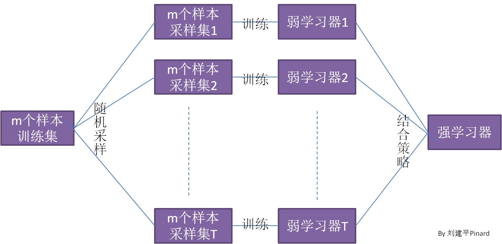

# 集成学习

构建并结合多个学习器来完成学习任务。

## AdaBoost

Boosting是一族将弱学习器提升为强学习器的算法。工作机制为：先从初始训练集训练出一个基学习器，再根据基学习器的表现对训练样本分布进行调整，使得先前基学习器做错的训练样本在后续得到更多关注，然后基于调整后的样本分布来训练下个基学习器；直到基学习器数目达到指定的数目 $T$，最终将这 $T$ 个基学习器进行加权结合。

AdaBoost算法：
______________________
**输入**：训练集 $D=\{(\boldsymbol x_1,y_1),(\boldsymbol x_2,y_2),\dots,(\boldsymbol x_m, y_m) \},y_i \in \{-1,+1\}$
$\quad \quad$ 基学习器算法 $h$
$\quad \quad$ 训练轮数 $T$
**过程**：

1. 初始化权重 $w_{1,1},w_{2,1},\dots,w_{m,1}$ 为 $1/m$，其中 $w_{i,j}$ 表示第 $i$ 个样本在第 $j$ 次若学习器学习中损失函数的权重;
2. **for** $t=1,2,\dots,T$ **do**
3. $\quad$ 训练 $h_t$，使其最小化带权重错误率 $\epsilon_t =\displaystyle \sum^n_{\stackrel{i=1}{h_t(x_i)\neq y_i}} w_{i,t}$
4. $\quad$ 计算第 $t$ 个基学习器的权重 $\alpha_t = \frac 1 2 \ln \left(\dfrac{1-\epsilon_t}{\epsilon_t} \right)$；
5. $\quad$ 更新所有样本权重 $w_{i,t+1} = w_{i,t} e^{-y_i \alpha_t h_t(\boldsymbol x_i)}, i=1,2,\dots,m$
6. $\quad$ 归一化样本权重 $w_{i,t+1}$，令其权重之和为 $1$，即 $$ w_{i,t+1} = \dfrac {w_{i,t} e^{-y_i \alpha_t h_t(\boldsymbol x_i)}}{\displaystyle\sum_{i=1}^m w_{i,t}e^{-y_i \alpha_t h_t(\boldsymbol x_i)}} $$ 可以证明 $$\dfrac{\sum_{h_{t+1}(x_i) = y_i} w_{i,t+1}}{\sum_{h_{t+1}(x_i) \neq y_i} w_{i,t+1}} = \dfrac{\sum_{h_t(x_i) = y_i} w_{i,t}}{\sum_{h_t(x_i) \neq y_i} w_{i,t}}$$ 可以利用这个式子简化计算。
7. **end for**

**输出**：$H(\boldsymbol x) = \text{sign} \left(\sum_{t=1}^T{\alpha_t h_t(\boldsymbol x)} \right)$
**注：对于不同的基学习器，得到 $h_t$ 的方法不一样，要根据原理进行推导，重新定义 $h_t$ 的计算过程。**
个人理解：相当于在原样本集合中按分布比例复制样本使得相同样本个数之比等于其权重之比，然后用原始的基学习算法去训练基学习器。当然，这只是这样理解，具体计算肯定要经过推导，简化带样本权重的基学习器学习过程，而不是放大样本集合再无脑训练。
______________________

## Bagging

bagging的大体算法描述流程图如下所示

其中随机采样的过程是，先随机从含有 $m$ 个样本的原始训练集中抽取一个样本放入采样集，然后放回原始训练集，这样下次仍然有可能被抽中，这样循环 $m$ 次，得到一个采样集。通过推理可以知道大约有 $63.2\%$ 的样本出现在采样集中。

结合策略可以是 平均法（简单平均法、加权平均法）、投票法（绝对多数投票法、加权投票法）或 学习法（通过另一个学习器来结合）。

## 随机森林（RF）

随机森林是 Bagging 的一个扩展变体。RF在以决策树作为基学习器构建 Bagging 集成的基础上，进一步在决策树的训练过程中引入了随机属性选择。具体来说，传统决策树在选择划分属性时是在当前结点的属性集合（假设有 $d$ 个属性）中选择一个最优属性；而在RF中，对基决策树的毎个结点，先中该结点的属性集合中随机选择一个包含 $k$ 个属性的子集，然后再中这个子集中选择最优划分属性用于划分。这里的参数 $k$ 控制了随机性的引入程度：若 $k=d$，则基决策树的构建与传统决策树相同；若 $k=1$，则是随机选择一个属性用于划分；一般情况下，推荐值 $k=\log_2d$.

## GBDT（梯度提升树）

### GBDT的负梯度拟合

GBDT（Gradient Boosting Decison Tree）的主体思想是根据前一次得到的强学习器 $f_{t-1}(\boldsymbol x)$，训练下一个弱学习器 $h_t(\boldsymbol x)$，使得这次的强学习器 $f_t(\boldsymbol x) = f_{t-1}(\boldsymbol x) + \beta_t h_t(\boldsymbol x),\quad \beta_t > 0$ 的损失函数 $L(y,f_t(\boldsymbol x)) < L(y, f_{t-1}(\boldsymbol x))$。如何实现呢——朝着 $L$ 下降的方向走不就OK了吗？对此，我们从得到的第 $t$ 个强分类器 $f_t(\boldsymbol x)$ 的损失函数的泰勒一阶展开说起。将 $f(\boldsymbol x)$ 整体看成自变量展开得到

$$ \begin{aligned}
L(y,f_t(\boldsymbol x)) & = L(y, f_{t-1}(\boldsymbol x) + \beta_t h_t(\boldsymbol x)) \\
& = L(y, f_{t-1}(\boldsymbol x)) + \beta_t h_t(\boldsymbol x) \frac {\partial {L(y, f_{t-1}(\boldsymbol x))} } { {\partial {f_{t-1}(\boldsymbol x)} } } + R_1(f_t(\boldsymbol x))
\end{aligned} $$

其中 $R_1$ 是其一阶余项，可以认为是个极小值。

为了在第 $t$ 次迭代后降低 $L$ 的值，只要上式的中间部分恒小于（理论上可能等于，对工程应用上来说影响不大）零即可，由于 $\beta_t > 0$ 因此令

$$  h_t(\boldsymbol x) = - \frac {\partial {L(y, f_{t-1}(\boldsymbol x))} } { {\partial {f_{t-1}(\boldsymbol x)} } } $$

我们已经得到了 $h_t$，现在只要优化求解 $\beta_t$，显然这是一个一维搜索问题

$$ \beta_t = \arg \min_{\beta_t} \sum_{i=1}^m L(y_i, f_{t-1}(\boldsymbol x_i) + \beta_t h_t(\boldsymbol x))$$

如何去得到 $h_t$ 呢？这下CART决策树派上用场了，我们用一棵CART回归树来拟合第 $t-1$ 次得到的强学习器的损失函数的负梯度，这就是负梯度拟合的原理，也是梯度提升树名字的由来。

以上讲的是梯度提升树的原理思想，具体到不同问题有具体的优化，比如对应分类问题和回归问题，尤其是二分类问题，有特定的优化方法，具体参考李航《统计学习方法》；对于不同的损失函数，也有不同的求解过程和优化手段，比较易于求解的是使用平方损失，这样梯度就变为为残差，求解十分便利。当然，具体问题具体分析才能发挥其最大威力。

### 实际使用的梯度提升树

以上是一般的梯度提升树的模型，在实际使用中，对于不同基函数、损失函数、分类或是回归问题，都不一样。

当实际问题是个二分类问题，基函数是个基本分类器（只使用一个属性作为最优划分属性的单层决策树），损失函数为指数损失时，GBDT就退化为AdaBoost。

当实际问题是个回归问题，基函数是个二叉决策回归树时，上面的基本模型能得到简化，基函数前面的系数 $\beta_t$ 可以省略，对于每一个系数，我们把它内化到二叉决策回归树中
$$ \beta_t h_t(\boldsymbol x) \quad 把 \beta_t 内化到二叉回归树，\beta_th_t 整体变为——> \quad h_t(\boldsymbol x) = \sum_{j=1}^J c_{mj}I(x \in R_{mj}) $$

具体参考《统计学习方法》

### GBDT常用损失函数

对于分类算法，其损失函数一般有对数损失函数和指数损失函数

**指数损失函数**：$L(y,f(\boldsymbol x)) = e^{-y f(\boldsymbol x)}$
**对数损失函数**：
$\quad \quad$ 二元分类：$L(y,f(\boldsymbol x)) = \log { (1 + e^{-y f(\boldsymbol x)} ) }$，其中 $ y \in \{ -1, +1 \} $
$\quad \quad$ 多元分类：$L(y,f(\boldsymbol x)) = - \displaystyle \sum_{k=1}^K {y_k \log p_k(\boldsymbol x)}$，其中如果样本输出类别为 $k$ 则 $y_k = 1$，否则 $y_k = 0$。$p_k(\boldsymbol x) = \displaystyle \frac {e^{f_k(\boldsymbol x)} } { \sum_{i=1}^K e^{f_i(\boldsymbol x)} }$

对于回归算法，常用的损失函数有以下几种

**均方损失**：$L(y,f(\boldsymbol x)) = {(y - f(\boldsymbol x))}^2$
**绝对损失**：$L(y,f(\boldsymbol x)) = |y - f(\boldsymbol x)|$
**Huber损失**，它是均方损失和绝对损失的折衷，对于远离中心的异常点，采用绝对损失，而中心点附近的采用均方损失，这个分界点一般用分位数点 $\delta$ 度量，其损失函数如下：
$L(y,f(\boldsymbol x)) = \begin{cases} \frac 1 2 (y-f(\boldsymbol x))^2, & \quad |y-f(\boldsymbol x)| \leq \delta \\ \delta(|y-f(\boldsymbol x)| - \frac{\delta}{2}), & \quad {|y-f(\boldsymbol x)| > \delta} \end{cases}$
**分位数损失**：$L(y, f(\boldsymbol x)) =\displaystyle \sum_{y \geq f(\boldsymbol x)} \theta |y - f(\boldsymbol x)| + \displaystyle \sum_{y < f(\boldsymbol x)} (1-\theta) |y-f(\boldsymbol x)|$

### GBDT的正则化

为了防止过拟合，GBDT也需要正则化，其正则化方法主要有以下几种方式：
**限定步长**：将步长定义为 $v$，对于前面的学习器迭代公式，则有
$$ f_t(\boldsymbol x) = f_{t-1}(\boldsymbol x) + v h_t(\boldsymbol x) $$

**子采样比例**：子采样比例取值为 $(0,1]$。这里的子采样与随机森林不一样，随机森林的子采样是有放回采样，这里是不放回采样。。如果取值为 1，则等价于未使用子采样，如果小于 1，则相当于只有部分样本去做决策树拟合。推荐值在 $[0.5,0.8]$ 之间。使用了子采样的梯度提升树也被称为**随机梯度提升树**。

**剪枝处理**：在每次迭代训练决策树的时候，使用剪枝方法来防止过拟合。

## XGBoost（XGBT）

XGBT的目标函数为：
$$\begin{aligned}
 J & = \sum_{i=1}^m L(y_i, f_t(\boldsymbol x_i)) + \Omega(h_t) + C \\
   & = \sum_{i=1}^m L(y_i, f_{t-1}(\boldsymbol x_i) + h_t(\boldsymbol x)) + \Omega(h_t) + C 
\end{aligned}$$

根据泰勒二阶展开式：$f(x+ \Delta x) \approx f(x) + f^\prime(x) \Delta x + \frac{1}{2}f^{\prime\prime}(x)\Delta x^2$，令

$$ u_i= \frac{\partial L(y_i,f_{t-1}(\boldsymbol x_i))}{\partial f_{t-1}(\boldsymbol x_i)}, \quad v_i = \frac{\partial^2 L(y_i,f_{t-1}(\boldsymbol x_i))}{\partial f_{t-1}^2(\boldsymbol x_i)}$$

将 $J$ 二阶展开

$$ J \approx \sum_{i=1}^m\left[ L(y_i, f_{t-1}(\boldsymbol x_i)) + u_i h_t(\boldsymbol x_i) + \frac 1 2 v_i h_t^2(\boldsymbol x_i)\right] + \Omega(h_t) + C$$

假定某决策树的叶节点数目为 $T$，所有叶节点的权重为 $\boldsymbol w = (w_1,w_2,\dots,w_T)$。弱学习器的决策树学习过程就是使用样本特征得到划分，拟合这些权重的过程。假设样本 $\boldsymbol x$ 落在第 $q$ 个叶节点中，定义弱学习器 $h$ 为 $h_t(\boldsymbol x) = w_{q(\boldsymbol x)}$

对于正则项，$\Omega(h_t) = \gamma^{T} + \frac{1}{2}\lambda \sum_{j=1}^T w_j^2$

则目标函数进一步简化

$$\begin{aligned} J & \approx \sum_{i=1}^m\left[ L(y_i, f_{t-1}(\boldsymbol x_i)) + u_i h_t(\boldsymbol x_i) + \frac 1 2 v_i h_t^2(\boldsymbol x_i)\right] + \Omega(h_t) + C \\
& = \sum_{i=1}^m \left[u_i h_t(\boldsymbol x_i) + \frac{1}{2}v_i h_i^2(\boldsymbol x_i)\right] + \Omega(f_t) + C  \quad //将上一次得到的 L 吸收到常数项 C \\
& = \sum_{i=1}^m \left[u_i w_{q(\boldsymbol x_i)} + \frac{1}{2}v_i w_{q(\boldsymbol x_i)}^2\right] + \gamma^T + \frac{1}{2}\lambda \sum_{j=1}^T w_j^2 + C \\
& =\sum_{j=1}^T \left[(\sum_{i \in I_j}u_i)w_j + \frac{1}{2}(\sum_{i \in I_j}v_i + \lambda)w_j^2\right]  +\gamma^T + C
\end{aligned}$$

定义 $$U_j = \sum_{i \in I_j}u_i, \quad V_j = \sum_{i \in I_j}v_i$$

从而 $$ J \approx \sum_{j=1}^{T} \left[U_j w_j + \frac{1}{2}(V_j + \lambda)w_j^2\right]  +\gamma^ {T} + C $$

上式对 $w_j$求偏导，得
$$\frac{\partial J}{\partial w_j} = U_j + (V_j + \lambda) w_j$$

令其偏导为 $0$，得到 $$w_j^* = - \frac {U_j}{V_j + \lambda}$$

代回目标代价函数，得到 $$J = -\frac{1}{2} \sum_{j=1}^T \frac{U_j^2}{V_j+\lambda} + \gamma^T$$